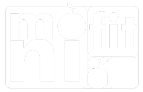

<div align="center">
  
  <p>A web-based nutrition tracker to help you achieve your health goals.</p>
  <p>
    <!-- Ganti URL badge sesuai dengan status proyek Anda -->
    
    
    
  </p>
</div>

---

## 📋 About MoniFit

**MoniFit** is a web application developed to address a common problem among university students: neglecting nutritional intake. Students, especially those living away from home, often prioritize saving money at the expense of a balanced diet. This can lead to long-term health risks and decreased productivity.

MoniFit provides a solution by offering a user-friendly platform to monitor daily nutritional consumption. With features like a BMR (Basal Metabolic Rate) calculator and a food logging system, it empowers users to evaluate their eating habits and make informed decisions to improve their overall health and well-being.

## ✨ Key Features

-   **Dashboard:** An overview of your daily nutritional progress.
-   **BMR Calculator:** Estimates your daily calorie needs based on your personal data.
-   **Food Logger (CRUD):** A complete system to create, read, update, and delete your daily food entries.
-   **Daily Grouping:** Automatically groups your food log by day with daily nutrition statistics.
-   **Automatic Calorie Calculation:** Calculates total calories based on macronutrient (protein, carbs, fat) input.
-   **Interactive UI:** Modern user interface with a date picker, dropdowns, and dialogs for a better user experience.
-   **Dark Mode:** Built-in support for a comfortable viewing experience in low-light environments.

## 🛠️ Tech Stack

This project is built with a modern TALL-like stack, utilizing the power of Laravel for the backend and React for a dynamic frontend.

-   **Backend:** Laravel 12
-   **Frontend:** React 18, TypeScript
-   **Stack:** Inertia.js, Vite
-   **Styling:** Tailwind CSS
-   **UI Components:** shadcn/ui
-   **Database:** MySQL

## 🚀 Getting Started

Follow these instructions to get a copy of the project up and running on your local machine for development and testing purposes.

### Prerequisites

Make sure you have the following software installed on your system:
-   PHP 8.2+
-   Composer
-   Node.js & npm
-   A local database server (e.g., MySQL via XAMPP)

### Installation

1.  **Clone the repository:**
    ```bash
    git clone [https://github.com/stevendotexe/monifit-pemweb.git](https://github.com/stevendotexe/monifit-pemweb.git)
    cd monifit-pemweb
    ```

2.  **Install PHP dependencies:**
    ```bash
    composer install
    ```

3.  **Install NPM dependencies:**
    ```bash
    npm install
    ```

4.  **Setup your environment file:**
    -   Copy the example environment file:
        ```bash
        cp .env.example .env
        ```
    -   Generate a new application key:
        ```bash
        php artisan key:generate
        ```

5.  **Configure your database:**
    -   Create a new database for the project.
    -   Update the following variables in your `.env` file:
        ```env
        DB_CONNECTION=mysql
        DB_HOST=127.0.0.1
        DB_PORT=3306
        DB_DATABASE=monifit
        DB_USERNAME=root
        DB_PASSWORD=
        ```

6.  **Run database migrations and seeders:**
    This will create all necessary tables and populate the database with default data (e.g., a test user).
    ```bash
    php artisan migrate:fresh --seed
    ```

7.  **Run the development servers:**
    This single command starts both the PHP and Vite servers.
    ```bash
    composer run dev
    ```

    Alternatively, you can run them in two separate terminals:
    ```bash
    # Terminal 1
    php artisan serve

    # Terminal 2
    npm run dev
    ```

8.  **You're all set!**
    -   Open your browser and navigate to `http://127.0.0.1:8000`.
    -   You can log in with the default user:
        -   **Email:** `test@example.com`
        -   **Password:** `password`

## 🤝 Contributing

Contributions are what make the open-source community such an amazing place to learn, inspire, and create. Any contributions you make are **greatly appreciated**.

## 👥 Authors

-   **Steven Martua Christian Simbolon**
-   **Muhammad Rafie Afkar Yunansyah**

<div align="center">
  <small>A project for the Web Programming course at Universitas Pendidikan Indonesia Kampus Cibiru.</small>
</div>
